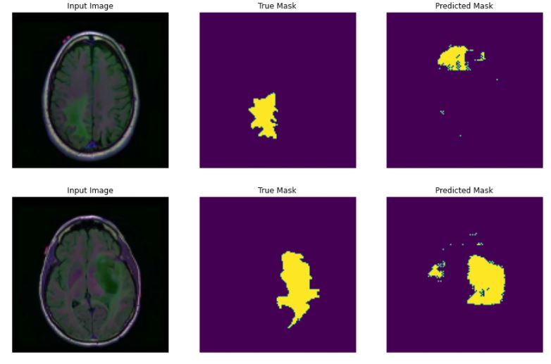
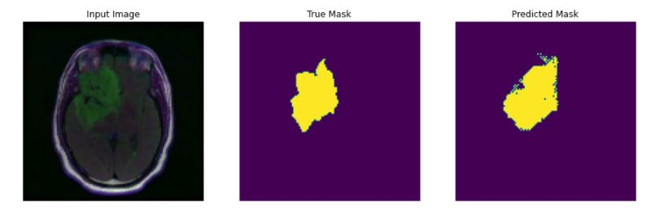
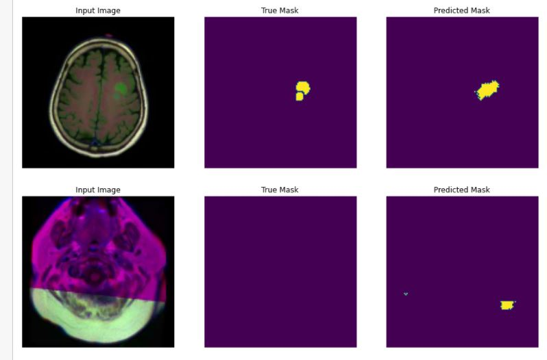
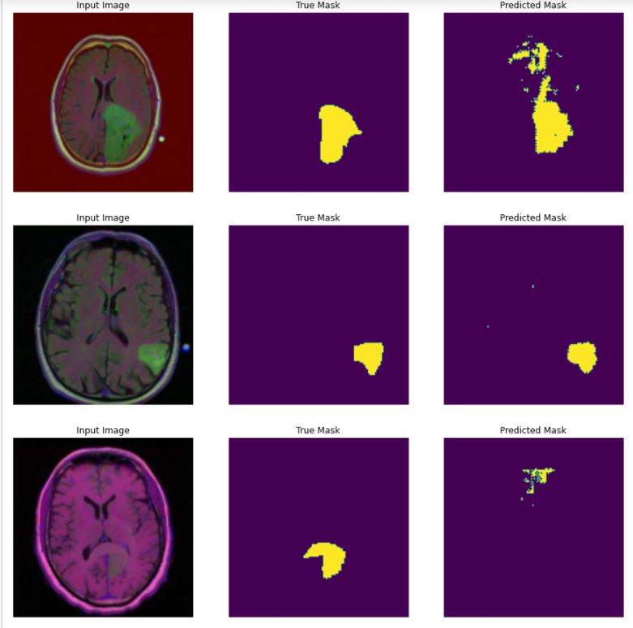
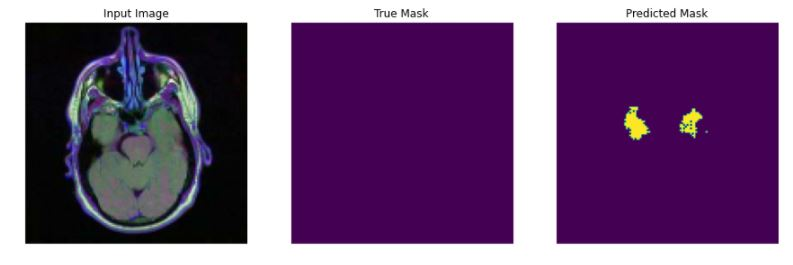

# Finetuning the segmentation model
## Some information
The purple color represents the value 0 and the yellow color represents the value 1.

## First result
The next few images are results from training 2 epochs with weighted values [1, 40]. Purple has in this case weight 1 and yellow weight 40, which means that getting yellow wrong will be punished 40 times harder by the loss function.

### My assumption
It needs to be said that I trained the model 4 times in total. I don't know if the 3 previous training sessions have an influence on the final result. At first glance it seemed like it always improved, so I would say that It does have an influence. 